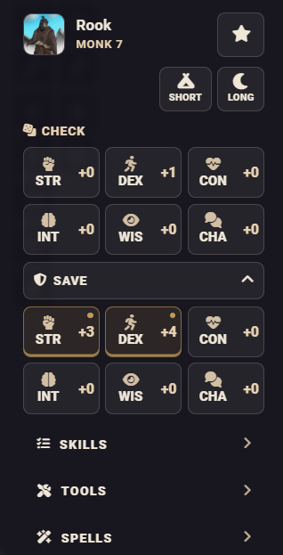

# Adventurer HUD

[English version](README.md)

[](https://foundryvtt.com/)
[](https://github.com/foundryvtt/dnd5e)


Интерфейс персонажа и боя для игроков в Foundry VTT 14 с системой D&D 5e.



## Установка

В Foundry VTT откройте **Установить модуль**, вставьте ссылку на манифест и
нажмите **Установить**:

```text
https://github.com/wondersalmon/adventurer-hud/releases/latest/download/module.json
```

## Совместимость

- Foundry VTT 14
- D&D 5e 5.3–6.x
- Не требует других модулей

HUD использует нативные API Foundry и D&D 5e и работает без модулей
автоматизации. События бросков передаются другим модулям, включая Midi-QOL, но
модули, заменяющие нативный процесс броска, могут изменять его поведение.

## Возможности

- Режим исследования, боевой режим и режим спасбросков от смерти
- Проверки, спасброски, навыки, инструменты, заклинания, оружие и действия
- ОЗ, временные ОЗ, КД, скорость, инициатива, ресурсы, состояния и ячейки заклинаний
- Нативное использование предметов и модификаторы бросков
- Автоматическое распознавание режима исследования, боя и спасбросков от смерти
- Адаптивная компоновка, размер текста и сохранение геометрии окна
- Отключаемая кнопка в панели токенов и настраиваемая горячая клавиша (`Shift+R` по умолчанию)


## Использование

Откройте HUD кнопкой с кубиком в панели токенов или назначенной горячей
клавишей. Боевой режим включается, когда выбранный персонаж участвует в активном
бою. Модуль не добавляет и не удаляет участников боя.

Карточки предметов используют нативный процесс D&D 5e. Кнопка с книгой открывает
лист предмета без его использования. Можно показывать дистанцию, бонус атаки,
урон, тип действия, цену ресурса, концентрацию и ритуал.

Кнопки бросков поддерживают нативные модификаторы: `Shift` выполняет быстрый
обычный бросок, `Alt` запрашивает преимущество, а `Ctrl` — помеху. Точное
поведение может зависеть от настроек D&D 5e и модулей автоматизации.

HUD также можно открыть из макроса:

```js
game.modules.get("adventurer-hud").api.open();
```

## Настройка

Откройте **Настройки Adventurer HUD** в настройках модулей Foundry или через
меню окна HUD. Основные параметры и сброс доступны непосредственно в настройках
модулей Foundry, а детальные параметры находятся под кнопкой **Дополнительные
настройки**. Через меню окна можно открыть настройки, закрепить HUD, включить
закрытие окна после броска и сбросить его размер и положение. Кнопку в панели
токенов можно скрыть, не отключая настраиваемую горячую клавишу.

Настройки сохраняются для пользователя, а размер и положение окна — для клиента.

## Использование ИИ

Инструменты ИИ использовались как помощники при разработке и ревью. Я сам
поддерживаю и тестирую модуль, понимаю его кодовую базу и отвечаю за её
дальнейшее сопровождение.

## Разработка

Требуется Node.js 22 или новее.

```text
npm ci
npm run check
npm run build
```

Системные адаптеры находятся в `scripts/systems`, вспомогательный код версий
D&D 5e — в `scripts/dnd5e`, а рендереры режимов и общие UI-компоненты — в
`scripts/hud`. Диспетчеризация рендера находится в `scripts/render`. Инструкция
по добавлению другой игровой системы:
[system adapter guide](docs/system-adapters.md).
