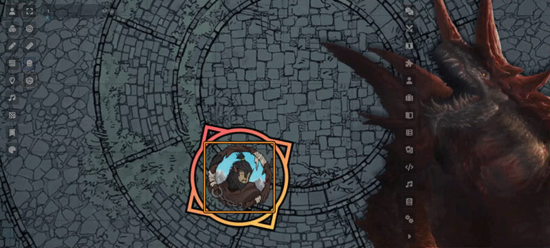

# Adventurer HUD

[English version](README.md)

[](https://foundryvtt.com/)
[](https://github.com/foundryvtt/dnd5e)

Adventurer HUD — компактная панель персонажа для [D&D 5e](https://github.com/foundryvtt/dnd5e). Она позволяет выполнять основные действия персонажа, не открывая его лист, и автоматически переключается между режимами исследования и боя.



## Как установить

В Foundry VTT откройте «Установить модуль», найдите **Adventurer HUD** в официальном каталоге и нажмите «Установить». Также можно открыть [страницу модуля в каталоге Foundry](https://foundryvtt.com/packages/adventurer-hud).

Другой способ — вставить в окно «Установить модуль» ссылку на манифест:

```text
https://github.com/wondersalmon/adventurer-hud/releases/latest/download/module.json
```

## Требования

- Foundry VTT версии 14
- D&D 5e версии 5.3 или новее

## Как пользоваться

Чтобы открыть HUD выбранного персонажа, нажмите `Shift+R` (сочетание клавиш можно изменить в настройках).
Включите **Открывать HUD при входе** в настройках модуля, чтобы панель открывалась при входе в мир и обновлении страницы.
В настройках модуля также можно включить кнопку открытия HUD на панели управления токенами.

## Использование ИИ

Инструменты ИИ использовались при разработке и проверке.
