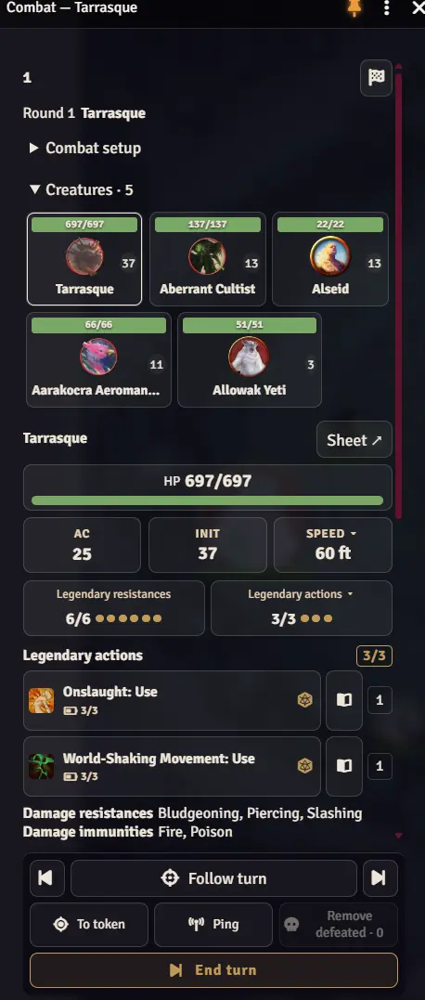
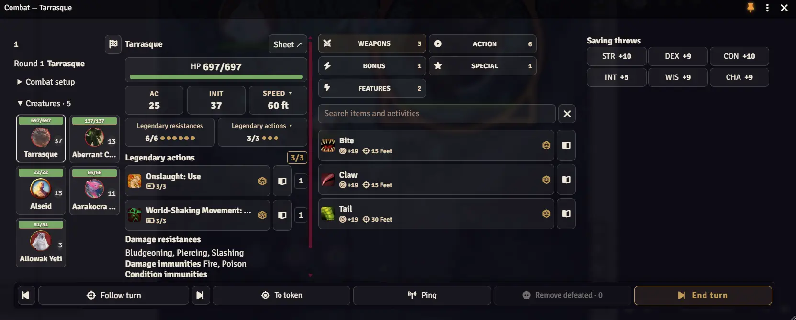

# HUD мастера

[README модуля](../README.ru.md) · [Руководство игрока](README.player.ru.md) · [English version](README.gm.md)

Боевая панель для Foundry VTT 14 и D&D 5e 5.3+. У мастера этот режим открывается по умолчанию; у игроков остаётся панель персонажа.

## Запуск

Откройте HUD через **Shift+R** или кнопку дракона на панели управления токенами, если она включена.

## Компоновка и настройки

Меняйте размер от узкой вертикальной панели до широкой и низкой. Кнопки управления ходами остаются внизу.

В настройках клавиш Foundry назначьте **GM: Предыдущий ход**, **GM: Следующий ход** и **GM: Закончить ход**. Они работают при открытой GM-панели.

### Компактная панель

### Широкая панель

