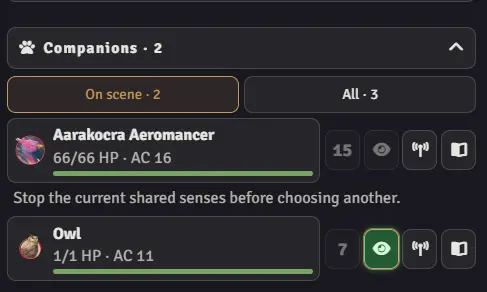

# Спутники и общие чувства

[Гайд игрока](player-guide.ru.md) · [Гайд GM](gm-guide.ru.md) · [English](companions-guide.md)

## Поиск и управление спутниками

Кнопка **Спутники** автоматически показывает принадлежащих вам персонажей и существ, кроме основного/назначенного персонажа.

Откройте действия спутника в том же окне; переключайтесь ниже **Вернуться к …**. Завершение его хода возвращает панель персонажа. Возвращение восстанавливает исходный токен персонажа, даже вне зрения спутника. **Следовать за выбором спутника** выбирает токен, использует его нативное зрение и центрирует камеру; отключите, чтобы менять только панель. Пинг отмечает токен без выбора. Эта настройка независима от камеры при общих чувствах.

## Размещение: игрок и GM

В **Все** кнопка **Добавить на сцену** размещает отсутствующее существо по прототипу токена. Выберите место; Escape или ПКМ отменяет. Нужны владение Actor и право создания токенов; игрок не может размещать во время паузы. Размещение не добавляет существо в бой. GM добавляет конкретный токен в сражение для инициативы.

Выдайте владение Actor или отдельным токеном, чтобы сделать спутника доступным. Владение только токеном открывает этот экземпляр; размещение из каталога требует владения Actor. Настройте прототип и зрение заранее. Заклинания призыва применяйте через нативные активности D&D, без ручных связей HUD.

## Общие чувства

Нажмите глаз в списке спутников на панели своего персонажа. Он добавляет нативное зрение спутника, сохраняя управление персонажем и его действия. Стены и настройки зрения действуют; слух и дистанция телепатии не моделируются. Камера по умолчанию остаётся на месте; **Перемещать камеру при общих чувствах** включается отдельно.

Оба токена должны находиться на сцене и быть управляемыми. У спутника должно быть включено зрение и больше 0 ОЗ. В бою заклинатель должен участвовать и иметь текущий ход. При нескольких токенах персонажа сначала выберите нужный. Причину недоступного глаза показывает подсказка.

Обычный режим доступен принадлежащим спутникам, не проверяет происхождение Find Familiar и не тратит бонусное действие. Согласуйте применимую способность с GM и учитывайте стоимость самостоятельно. Чувства действуют до начала следующего хода заклинателя или шесть секунд продвинутого игрового времени вне боя. Зелёный глаз и сообщение отмечают работу; повторное нажатие завершает её. Смена токена/панели, закрытие или повторное открытие прекращают обмен.

## Необязательный режим Find Familiar (2024)

**Настройки спутников → Зрение фамильяра (2024)** по умолчанию выключено. Включите добровольно для нативного призыва Find Familiar. Режим проверяет происхождение призыва и допустимость заклинателя, отклоняет недееспособность и запускает нативную активность бонусного действия на предмете призыва без ещё одной ячейки. Нативная отмена не запускает обмен. Активность создаётся один раз и остаётся на предмете; её можно проверить в листе. Фильтр **Фамильяры** появляется для нативно связанных фамильяров, включая отсутствующих в полном списке.

При включённой в HUD **Фазовой инициативе SC** кастер может разделять чувства, пока ещё действует в своей текущей фазе, даже если указатель трекера стоит на другом участнике. В режиме 2024 используйте половину действий. Переход к действиям или «Готово» другого участника не завершает связь; она заканчивается на следующем ходе кастера.
