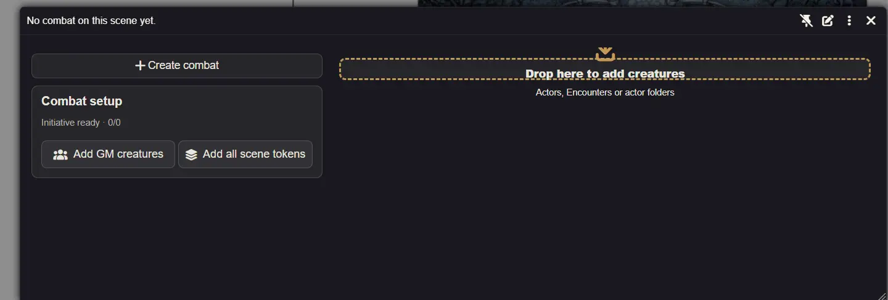
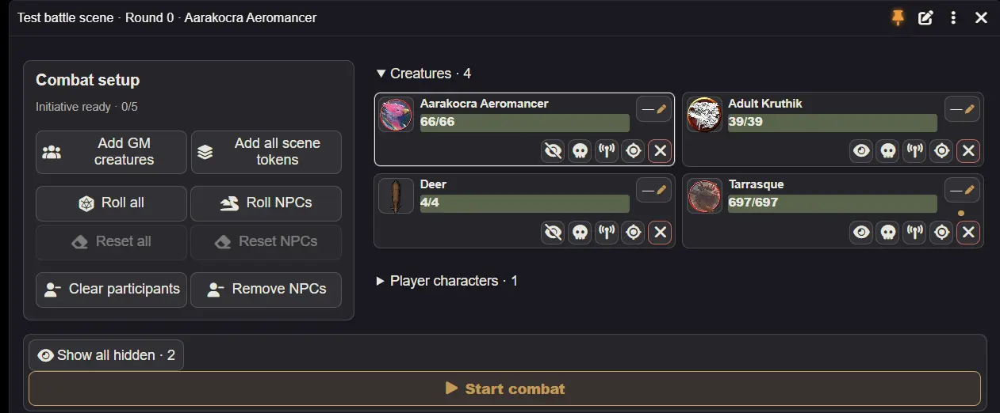
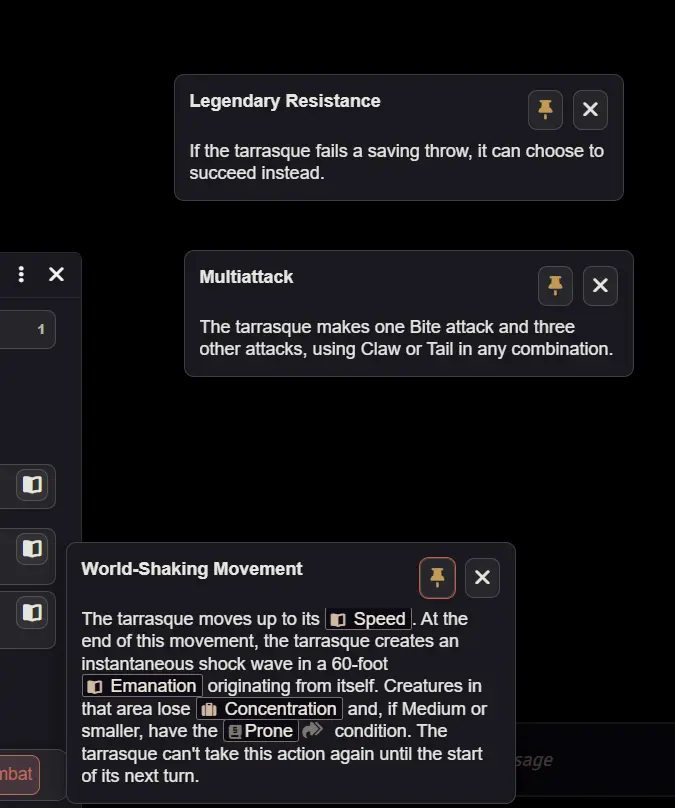
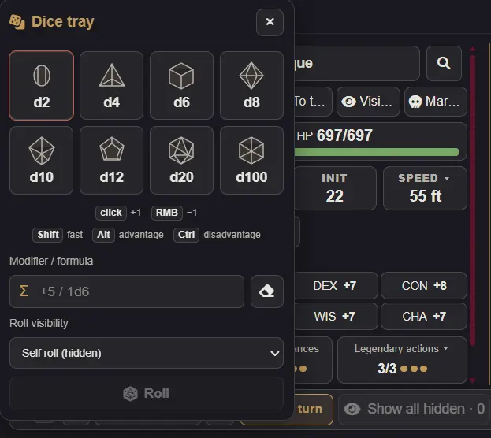

# GM HUD

[About](../README.md) · [Player guide](player-guide.md) · [Layout editor](layout-guide.md) · [Companions](companions-guide.md) · [Version notes](release-2.0.md) · [Русский](gm-guide.ru.md)

Enable **Use GM panel** in GM settings and press **Shift+R**. **⋮** opens settings, Troubleshooting and the player-mode switch. The pin locks movement and resizing. New GM windows start at 1000 × 450 in the bottom-left corner; saved geometry takes priority.

## Prepare an encounter

Choose the encounter if the scene has several. Add GM creatures or all scene tokens. Roll initiative for all participants or only NPCs; a fully rolled group asks before rerolling. Click an empty initiative value to roll it immediately; an existing value opens editing, rerolling and clearing.

Preparation includes all/NPC initiative resets and individual/group participant removal. Removing a participant keeps its scene token. **Start combat** stays visible in the bottom toolbar. Preparation blocks can be rearranged with the [layout editor](layout-guide.md).

Drag an NPC actor from Actors or a compendium onto the creature list during preparation or combat. Actor folders from either source also work, including subfolders. **Encounter** actors add their NPC members with the configured quantities; quantity formulas use the system’s normal rolls. Folders can include Encounters; the Encounter’s own token is not added. **Drop here** appears as dragging starts and marks the destination. Foundry lets you place each new token on the current scene, then adds the placed tokens to the selected encounter. Canceling placement adds no participants. Compendium creatures are imported into Actors first; those documents remain if placement is canceled. Drag and drop is enabled by default; disable **Add creatures by drag and drop** in GM settings if needed.

## Initiative and turns

**Follow turn** opens the native tracker's current participant, including player characters and defeated creatures. Selecting a card manually pauses following. The main accent always marks the native current turn; a separate outline marks the inspected card.

**End turn** advances the encounter exactly once and opens the new current participant, including a player character. Previous/next controls use native turn order. Previous turn is disabled at the first participant of round one. GM settings offer manual selection or following turns.

## Manage a creature

Click its name for the sheet or portrait for an image with Foundry's sharing controls. Search is beside the name; the clear button is inside its field. The row underneath offers **Ping**, **To token**, **Hidden/Visible**, **Defeated** and, for an eligible defeated NPC, red **Remove**. Compact icons also appear on roster cards. Hidden controls apply to GM NPC tokens, excluding player-owned companions. Rapid state toggles pause while updates finish.

**Show all hidden** in the bottom toolbar confirms before revealing hidden GM NPC tokens in the selected encounter. Visibility affects the native token. **Defeated** marks or unmarks defeat; defeated panels can appear gray while their ordinary controls remain usable. Individual or group removal confirms before deleting defeated NPC tokens and their remaining initiative entries; Actor-directory creatures and player-owned companions are preserved. Tokens deleted from the map disappear from the roster.

Click **HP** for damage, healing or an absolute value. Effects appear near the top; roster hover shows name, HP and effects, including **No effects**. Defenses and vulnerabilities start collapsed. Other speeds expand below their control. Saves, resources and abilities use normal D&D 5e permissions, mechanics and dialogs.

Action grouping follows activity activation types, including Epic, Villain and legendary actions. **Features** initially shows activated abilities; **Show passive features** switches to passive traits and remembers the choice for that character. If an ability is missing, check its item activities, grouping and filters. A custom sheet heading alone does not create an activity type. The book inside a card opens its item; Shift-click shares its description. Pinned previews can be moved by their header or keyboard arrows while other hover previews remain available.

The dice button opens the tray with public, private GM, blind GM and self roll modes; GM rolls default to hidden self rolls. Roster and details columns start compact, leaving room for actions. Wider rosters use up to four columns, and action lists use two when space allows. GM block layouts are shared across creatures. See the [layout editor](layout-guide.md) for moving categories, adding a column, hiding and resetting.

## Settings and troubleshooting

GM and player display settings are separate. Adjust selection, action grouping, filters, cards and window behavior in GM settings. Ownership, summons and shared senses are explained in the [companions guide](companions-guide.md).

Use **Record a problem**, reproduce it, then stop and preview or download the report. Recording stops after ten minutes. Reports contain bounded HUD events and anonymous technical context; error text is opt-in. Review text before sharing. Nothing uploads automatically.

**Check and repair** checks preferences, layouts, selected installed files and required features. Repair shows its changes before confirmation, backs up original settings, preserves valid preferences and respects GM permissions. It fixes malformed data, duplicate placements and supported legacy layout entries; unknown data remains for manual review. Download the before-repair backup for recovery. File or missing-system problems require fixing the installation; this check does not verify every module function.
