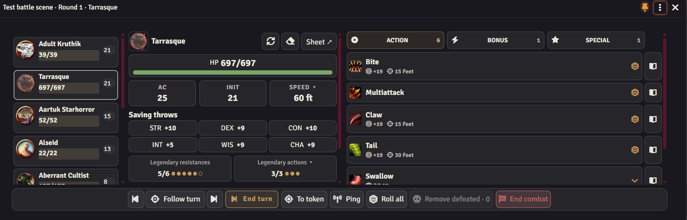

# GM HUD

[About the module](../README.md) · [Player HUD](player-guide.md) · [Русский](gm-guide.ru.md)

Press **Shift+R** to open or close the HUD. GMs use GM mode by default. The **⋮** menu switches to the character panel and back without changing your permissions. If no character is available or you cancel the picker, GM mode stays active.

The pin locks position and size; GM and player panels remember them separately. Escape does not close the HUD by default; allow this in additional settings. The window title shows the scene, round and selected creature.

The panel opens when combat is created if automatic opening is enabled. Before starting, setup buttons are immediately available: add NPCs or scene tokens, roll initiative and start combat. Monsters form a grid on the left; player characters added to combat appear on the right. Reset initiative before starting if needed. The setup block disappears once combat begins.

During preparation, both lists can collapse. Right-click a card to reset only that participant's initiative. In combat, the left list shows the full initiative order, with player characters marked by an icon and color. Beside the monster's name are reroll, reset and, when defeated, a skull to remove its token. The group roll stays on the bottom bar. End turn advances the current combat turn even when another creature is selected.

Select a creature to see its HP, AC, movement, saves and actions. Legendary resources appear when it has them. Items and abilities use normal D&D 5e mechanics. The sheet button opens the creature's full sheet.

By default, GM mode hides search and shows only action types, with spells alongside other actions. Turn off **Hide search in GM mode** or **Only action types in GM mode** in GM settings to bring back search and the Weapons, Spells and Features tabs.

**Follow turn** automatically selects the current NPC. Choosing a creature yourself turns following off; you can turn it back on. Previous, next and End turn control the initiative order. Assign shortcuts for them in Foundry's control settings.

Click **HP** to enter damage, healing or temporary HP. The token button selects the creature and moves the camera; ping points it out to players. Removing dead creatures deletes their encounter tokens from the current scene and keeps Actor directory entries. Automatic removal is a separate GM setting.

If something breaks, open **Check integrity → Download error report** in the module settings. Do this before reloading: the file includes errors from this tab and version information to help troubleshoot.

