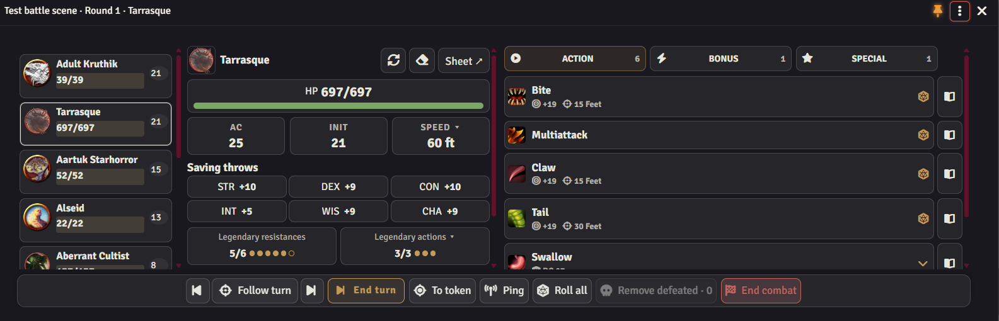

# HUD мастера

[О модуле](../README.ru.md) · [HUD игрока](player-guide.ru.md) · [English](gm-guide.md)

Нажмите **Shift+R**, чтобы открыть или закрыть HUD. У мастера по умолчанию включён GM-режим. В меню **⋮** можно перейти к панели персонажа и обратно — права пользователя от этого не меняются. Если персонаж не найден или выбор отменён, останется GM-режим.

Булавка фиксирует положение и размер; GM и панель игрока запоминают их отдельно. Escape по умолчанию не закрывает HUD — это можно разрешить в дополнительных настройках. Сцена, раунд и выбранное существо показаны в заголовке окна.

Панель автоматически открывается при создании боя, если включена соответствующая настройка. До старта все кнопки подготовки видны сразу: добавьте NPC или токены сцены, бросьте инициативу и начните бой. Монстры расположены сеткой слева, персонажи игроков, добавленные в бой, — справа. Инициативу можно сбросить штатной кнопкой до старта. После начала боя блок подготовки исчезает.

В подготовке оба списка можно свернуть. ПКМ на карточке сбрасывает инициативу только этого участника. В бою слева показан весь порядок инициативы; персонажи игроков отмечены значком и цветом. Рядом с именем монстра доступны переброс, сброс и, для мёртвого, череп для удаления его токена. Общий бросок остаётся внизу. «Закончить ход» управляет текущим ходом боя, даже если выбрано другое существо.

Выберите существо в списке: рядом появятся HP, КД, скорость, спасброски и действия. Легендарные ресурсы показываются, если они есть. Предметы и способности используют обычную механику D&D 5e. Кнопка листа открывает полный лист существа.

По умолчанию поиск скрыт, а вместо вкладок оружия, заклинаний и особенностей остаются типы действий. Заклинания показаны вместе с другими действиями. Чтобы вернуть поиск и вкладки, выключите **«Скрывать поиск в GM-режиме»** и **«Только типы действий в GM-режиме»** в настройках мастера.

**Следование за ходом** автоматически выбирает текущего NPC. Ручной выбор отключает следование; его можно включить снова. Кнопки предыдущего, следующего и завершения хода управляют очередью инициативы. Для них можно назначить сочетания клавиш в Foundry.

Нажмите на **HP**, чтобы внести урон, лечение или временные хиты. **К токену** выделяет существо и перемещает камеру, пинг показывает его игрокам. Удаление погибших убирает токены этого боя с текущей сцены, сохраняя актёров в каталоге. Автоматическое удаление включается отдельно в настройках GM.

Если что-то сломалось, откройте в настройках модуля **«Проверить целостность» → «Скачать отчёт об ошибках»**. Лучше сделать это до перезагрузки страницы: файл сохранит ошибки текущей вкладки и версии для разбора проблемы.

