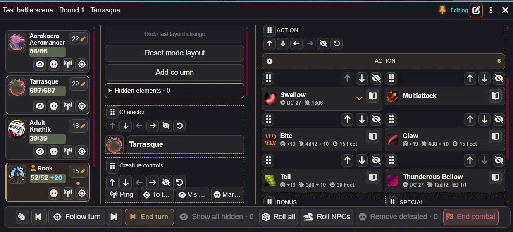

# HUD layout editor

[Player guide](player-guide.md) · [GM guide](gm-guide.md) · [Version notes](release-2.0.md) · [Русский](layout-guide.ru.md)

Click the pen beside the pin to enter or leave **Edit HUD**. Controls edit the layout while this mode is active; ability cards do not perform their usual actions.

- **Order:** drag a block's handle or use its up/down arrows. Tabs and item cards have their own order controls.
- **Columns:** left/right arrows move a block to the adjacent column. Action categories, defenses and creature controls can move independently. Dragging can also place a block among other blocks.
- **Extra column:** add one from the editor toolbar, then move blocks into it. Player mode allows two dividers; GM mode allows three. Drag dividers to resize columns when the window is unpinned. Narrow windows stack content instead.
- **Hide and restore:** use the eye; restore blocks from **Hidden elements**, and tabs/cards from their list's **Hidden** controls. Hiding the open category closes its content.
- **Reset and undo:** reset a block with its curved arrow or reset the current mode's layout from the editor toolbar. Undo restores the last edit, including a layout reset, during this session. Leaving editing keeps the layout; closing the window while editing asks for confirmation.

Player layouts belong to each character and mode; hiding search or shortcut hints applies to both player modes. GM block layouts are shared by all creatures, with separate preparation and combat layouts. Native sheet item order and favorites remain unchanged. Saved divider positions and window sizes take priority over defaults.

