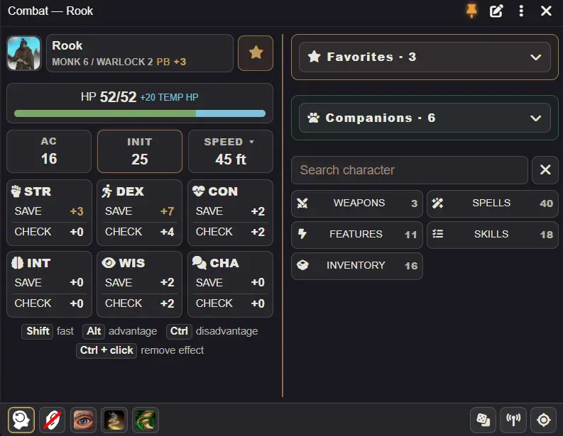

# Player HUD

[About](../README.md) · [GM guide](gm-guide.md) · [Companions](companions-guide.md) · [Version 2.0](release-2.0.md) · [Русский](player-guide.ru.md)

Select your character's token and press **Shift+R** to open or close the HUD. Without a token, choose an available character. The portrait/name opens the sheet; the pin locks movement and resizing. **⋮** contains settings, Troubleshooting and manual mode controls.

## Exploration and combat

Exploration provides checks, saves, skills, proficient tools, spells, inventory and rests. Skills open initially; click an expanded section again to collapse it. Combat appears when your character joins an encounter, before its first round. Separate buttons open weapon, spell, action, feature, skill and inventory categories at every width; click again to collapse. Features can switch between active and passive entries.

Initiative requires a combat participant. **End turn** is available on your turn. The fixed bottom toolbar is enabled by default and holds effects, End turn, dice, ping and token focus; disabling it returns the other controls to their usual positions and hides the tray button. Shortcut hints start at the bottom of the left column. Ctrl+left-click an effect, or focus it and press Ctrl+Enter/Space, to remove it; hover for its native description.

Click **HP** for damage `-7`, healing `+5` or a new value `12`; temporary HP is separate. Shift-click restores HP to maximum. Death saves appear at 0 HP when needed. Inspiration is beside your name; in exploration, compact short/long rest buttons sit beside it with hover labels. Saves and checks stay open. Expand speed for other movement types.

## Search, favorites and cards

Character search covers all items, activities, skills, tools, saves and checks regardless of the visible tab. Names come from your sheet, not the HUD language. Results retain native controls and rolls. Inventory provides equipment/consumable/other filters, weight and nonzero coins in both modes.

Favorites sync with the native sheet. Card stars add/remove items or activities. The global **Favorites** setting hides both the panel and stars; hiding the panel with the editor keeps stars and saved favorites.

Actions use native D&D dialogs, resources and cancellation. Shift+left-click requests a quick roll; Alt/Ctrl requests advantage/disadvantage where supported. The book button inside the ability card opens the item sheet; Shift-click shares its description in chat. Hover/focus previews descriptions; pin previews to keep them open while viewing other abilities. Drag a pinned preview by its header, or focus the header and use arrow keys. Escape closes it. Click spell level headings to collapse groups.

## Edit your HUD

The pen beside the pin opens the editor. See the [layout editor](layout-guide.md) for moving blocks/categories, an extra column, hide/restore and reset/undo. Player layouts save per character and mode; native sheet order and favorites stay intact.

Coins and carried weight appear inside the open Inventory section. Clicking the summary opens Inventory in the character sheet. Weight changes color with encumbrance. Combat skills start collapsed.

The footer center shows your last three completed HUD actions (two in narrow windows). Click an icon to repeat through the usual roll or activity dialog, with current resources and click modifiers. Hover for its name. Cancelled actions are excluded. History is separate for each character, shared between Explore and Combat, and cleared when the browser tab reloads.

## Window and settings

New player windows start at about 640 × 500 at the left edge, starting at top 710 px when the screen allows. Existing geometry takes priority. Unpin to resize an edge along one axis, resize a corner, or adjust the column divider with dragging/arrow keys. Moving near an edge snaps the window to it.

Main settings contain language, theme, text size, opening on login, sliding and opening on joining combat. **Additional settings** groups window behavior, window/layout, panel content, cards/actions and controls. There you can choose the two-column threshold (450–1200), separate mode sizes, HUD dimensions, bottom toolbar and scrolling to opened sections. Spell level headings retain ordinary scrolling. The two-column threshold defaults to 450 px and the left column to 48%. Sliding is enabled by default and can be disabled; opening on joining combat is optional. The latter opens a closed HUD; an already open HUD switches when added to combat regardless of that preference. GM preferences remain independent.

## Dice tray

Open the dice button beside ping in the bottom toolbar. Choose d2/d4/d6/d8/d10/d12/d20/d100: left-click adds one, right-click removes one, minimum zero. Shift-click rolls one immediately; Alt/Ctrl rolls two and keeps the higher/lower result. Quick rolls leave the set intact. **Roll** rolls the set with an optional modifier/additional formula, such as `-2` or `1d6 + @abilities.dex.mod`; a formula also works alone. **Clear** removes the set and formula. Choose public, private GM, blind GM or self visibility; the initial selection follows your native chat setting. Escape, the close button or clicking outside closes the tray; refresh/creature switching also closes it.

## Backup and help

**Troubleshooting** exports/restores personal settings, layouts and windows as JSON. Restore updates open panels; failures attempt rollback and warn if incomplete. A window reset changes geometry only. **Reset all** also clears block/card layouts, while native favorites remain. Reset is optional after upgrading; restore hidden content through the editor first. See the [companions guide](companions-guide.md) for shared senses and the optional 2024 mode.

**Check and repair** checks settings, layouts, required files and registrations. Repairs show the proposed changes and ask for confirmation; GM-only settings require a GM. Download the original data backup after repair. Unrecognized layout blocks are preserved for manual review.
