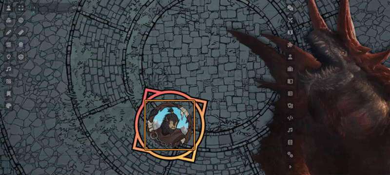

# HUD игрока

[О модуле](../README.ru.md) · [HUD мастера](gm-guide.ru.md) · [English](player-guide.md)

Выберите токен персонажа и нажмите **Shift+R**, чтобы открыть или закрыть панель. Без выбранного токена HUD откроет единственного доступного персонажа или предложит выбор.

Булавка фиксирует положение и размер панели. Escape по умолчанию её не закрывает; это можно разрешить в дополнительных настройках. Если закрыть HUD, после обновления страницы он останется закрытым.

Вне боя доступны проверки, спасброски, навыки, инструменты, инвентарь, заклинания и вдохновение. Отдых запускайте из листа персонажа. В активном бою панель переключается на оружие, заклинания, действия и особенности. Ручные кнопки режимов можно включить в **⋮**. Нажмите на портрет или имя, чтобы открыть лист персонажа; с клавиатуры — Tab и Enter.

Используйте поиск, чтобы найти нужное действие. Избранное повторяет список из листа персонажа, включая современные листы Tidy. Навыки можно отфильтровать по владению, заклинания — по подготовке; оставшиеся ячейки видны рядом с уровнями.

Предметы и способности используют обычные диалоги и ресурсы D&D 5e. При нескольких активностях можно выбрать нужную прямо в карточке. **Shift** пропускает этот выбор и запускает обычное использование предмета. Для бросков **Shift**, **Alt** и **Ctrl** работают там, где D&D поддерживает быстрый бросок, преимущество и помеху. Отдельная кнопка открывает лист предмета, а **Shift** на ней отправляет описание в чат.

Нажмите на **HP**: введите новое значение или изменение вроде `-7` или `+5`, временные хиты — отдельно. При 0 HP появятся спасброски от смерти, если они нужны. Наведите на состояние, чтобы прочитать описание. В свой ход нажмите **Закончить ход**, чтобы передать очередь дальше.

Если что-то сломалось, откройте в настройках модуля **«Проверить целостность» → «Скачать отчёт об ошибках»**. Лучше сделать это до перезагрузки страницы: файл сохранит ошибки текущей вкладки и версии для разбора проблемы.

