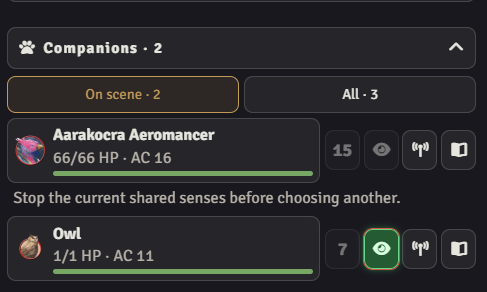

# HUD игрока

[О модуле](../README.ru.md) · [HUD мастера](gm-guide.ru.md) · [English](player-guide.md)

Выберите токен персонажа и нажмите **Shift+R**, чтобы открыть или закрыть HUD. Без токена панель откроет единственного доступного персонажа или предложит выбор. Портрет открывает лист; булавка фиксирует положение и размер окна. **⋮** даёт доступ к настройкам и ручному переключению режимов.

## Персонаж и действия

В исследовании доступны проверки, спасброски, навыки, инструменты, заклинания, инвентарь и отдых. Боевые действия появляются, когда персонаж участвует в начавшемся бою. Инициативу можно бросить после добавления токена в бой; **«Закончить ход»** доступно в свой ход.

Нажмите на **ОЗ** для урона `-7`, лечения `+5` или нового значения `12`; временные хиты вводятся отдельно. При 0 ОЗ появляются спасброски от смерти, если нужны. Прицел рядом с именем выбирает токен и центрирует камеру в обоих режимах.

Поиск и фильтры помогают находить действия. Инвентарь показывает вес, грузоподъёмность и золото. Избранное повторяет список из листа персонажа; звезда в заголовке включает редактирование.

Действия используют диалоги и ресурсы D&D 5e. Нужную активность предмета выбирайте в карточке. **Shift+ЛКМ** пропускает выбор и запускает быстрый бросок; **Alt/Ctrl+ЛКМ** — преимущество/помеху там, где поддерживает система. **ПКМ** открывает лист предмета, **Shift+ПКМ** отправляет описание в чат.

Наведите курсор на карточку или выберите её клавиатурой, чтобы прочитать описание. Булавка или **F2** закрепляет его, **Escape** закрывает. Автоматический показ можно отключить в **Дополнительных настройках → Карточки и действия**. **«Особенности»** по умолчанию показывает способности с активацией, включая Epic Actions. Переключатель **«Показывать пассивные черты»** переключает список на Darkvision и другие пассивные записи, а **«Показывать активные особенности»** возвращает активные; выбор сохраняется для этого персонажа.

## Спутники на сцене и в бою

**«Спутники»** автоматически включает персонажей и существ во владении, кроме основного героя. По умолчанию открыт раздел **«На сцене»**; **«Все»** включает существ без токена здесь. Строки содержат лист, здоровье, КД и эффекты, обновляясь при изменении владения и токенов.

Строка открывает действия спутника в том же окне; под **«Вернуться к …»** можно выбрать другого. Возврат восстанавливает исходный токен героя, даже вне зрения спутника. Переключение выбирает токен, центрирует камеру и использует его зрение; отключите **«Следовать выбору спутника»**, чтобы менять только панель. Пинг отмечает спутника, сохраняя выделение.

В разделе **«Все»** кнопка **«Добавить на сцену»** рядом с существом размещает его прототип токена. Выберите место; **Escape** или ПКМ отменяет размещение. Нужны владение и право создавать токены; игроку недоступно размещение во время паузы. После размещения кнопка исчезает, дублирующая строка не появляется. Несколько токенов объединены в строку с выбором экземпляра при действии. Заклинание призыва используйте через D&D 5e.

## Зрение фамильяра

Для **«Поиска фамильяра» (2024)** нажмите глаз в строке спутника из панели героя. Он добавляет настроенные чувства фамильяра; герой остаётся выделенным со своими действиями. Камера переезжает к фамильяру, а перемещение управляет героем. Чтобы камера оставалась на месте, отключите **«Перемещать камеру при общих чувствах»** в настройках **«Спутники»**. Зелёный глаз и сообщение показывают, что связь включена.

Включайте связь в ход героя: она длится до начала следующего хода или шесть секунд **игрового времени** вне боя. Расход бонусного действия и остальные условия заклинания учитывайте самостоятельно. Повторное нажатие глаза или возврат чувств завершает связь раньше. Смена токена или панели, повторное открытие или закрытие HUD также её прекращают.

Недоступный глаз показывает причину под строкой. Оба токена должны быть на сцене и доступны для управления; фамильяру нужны включённое зрение и ОЗ больше нуля. В бою токен героя должен быть участником, а текущий ход — принадлежать ему. Если токенов героя несколько, сначала выберите нужный. См. [настройку у мастера](gm-guide.ru.md#спутники-игроков).
