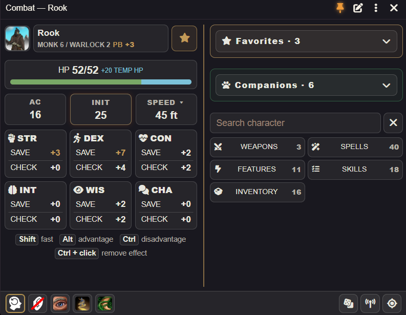

# Adventurer HUD 2.0

[Player guide](player-guide.md) · [GM guide](gm-guide.md) · [Companions](companions-guide.md) · [Русский](release-2.0.ru.md)

## New features

### One HUD editor

The pen beside the pin edits blocks, tabs and item lists in one place. Drag or use arrows to change order, move blocks between columns, hide elements and restore them from the editor's hidden lists. Inventory uses the same card editor in exploration and combat. Layouts belong to the character/mode or exact GM token; native sheet item order and favorites remain unchanged.

### Character-wide search and dice tray

A movable search panel covers all items, activities, skills, proficient tools, saves and checks, including entries from hidden tabs. Results use native actions and roll modifiers.

The bottom-toolbar dice button opens a compact tray above it: d2 through d100, a collected set, optional modifier/formula and Clear.

### Optional familiar senses (2024) and personal backups

The optional 2024 mode checks native Find Familiar summon provenance and caster eligibility, then uses a native Bonus Action activity without another spell slot. It adds a Familiars filter. Camera movement and following companion selection remain separate. See the [companions guide](companions-guide.md) for ordinary and 2024 senses.

## Behavior and interface changes

The player HUD now uses a two-column layout by default: character details, HP, saves and checks on the left; favorites, companions, search and action categories on the right. Effects and quick controls sit in the bottom toolbar. Narrow windows switch to one column; existing saved layouts and window preferences are preserved.

- Exploration and combat share persistent favorites, companions and inventory access. Combat categories use separate collapsible buttons at narrow and wide sizes; feature filtering remembers active/passive selection.
- The fixed bottom toolbar holds effects, End turn, dice, ping and focus. Identity, inspiration, rests and always-open checks/saves use a more compact arrangement. Effects include native applicable effects; Ctrl-click removes eligible effects. Inventory shows weight and all nonzero coin denominations.
- New player windows start at 640 × 500, with top 710 px when the screen allows. Adjustable columns, edge snapping, separate mode sizes and side-edge resizing improve placement. Existing sizes remain your choice; the two-column threshold defaults to 450 and the left column to 48%. Slide mode is enabled by default and stows the window.
- Settings separate global preferences from character/token layouts, with groups for window behavior, layout, content, cards and controls. Player/GM search remains independent. Global Favorites disables both panel and stars; editor hiding affects the panel only.
- Joining combat switches an open character panel automatically. The optional opening setting controls a closed panel. Exploration companions use stable order without initiative; combat keeps turn-first/participant/initiative ordering and gold unrolled frames.

## Fixes

- Restoring settings no longer loses layouts on the next click or through older queued saves; supported legacy backups import without requiring a reset.
- Reset all includes block/card layouts; geometry-only resets preserve them and native favorites remain intact.
- Inventory cards obey editing, drag, hide and order preferences; hiding an active tab closes its content and GM fallback skips hidden categories.
- Refresh preserves search input, focus and scroll; effects, spell groups, companion navigation and window lifecycle have clearer boundaries.

**Compatibility and updating.** Foundry VTT 14; D&D 5e 5.3+ (manifest verified system: 6.0.3). Update the module normally and reload Foundry clients. Existing preferences, editor data and native favorites are retained; no forced reset or migration is needed. Back up settings first if desired. To return hidden blocks, use the editor; resetting a window is optional for adopting its default size. Reset all is a voluntary way to discard personal HUD preferences.

**Limits.** The 2024 senses option stays off until enabled and needs native summon provenance. Bonus Action availability and spell requirements remain part of your table's procedures. Dice formulas are evaluated by Foundry. Mock/browser checks cannot establish live Foundry compatibility; native senses, summon token instances and action-tracking integrations still need a live-world check before publication. This preparation does not publish the release.
