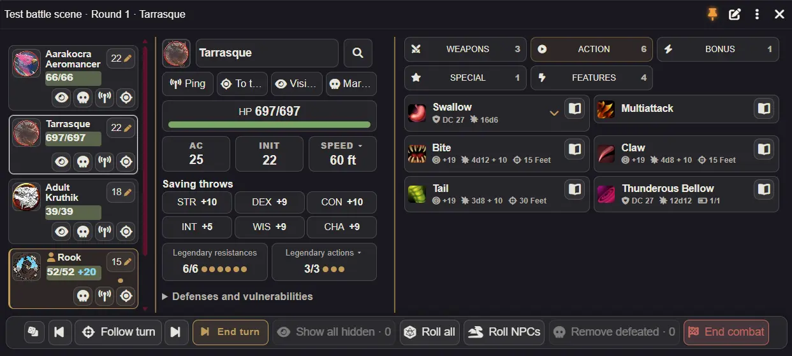

# Adventurer HUD 2.0

[Гайд игрока](player-guide.ru.md) · [Гайд GM](gm-guide.ru.md) · [Спутники](companions-guide.ru.md) · [English](release-2.0.md)

## Новые возможности

### Единый редактор HUD

Перо рядом с булавкой редактирует блоки, вкладки и списки предметов. Перетаскивайте или используйте стрелки для порядка, переносите блоки между колонками, скрывайте и возвращайте элементы через списки скрытого. Инвентарь использует тот же редактор в исследовании и бою. Компоновки игрока относятся к персонажу/режиму; компоновка блоков GM общая для существ; нативный порядок предметов и избранное листа сохраняются.

### Общий поиск и дайс-трей

Перемещаемый поиск охватывает все предметы, активности, навыки, освоенные инструменты, спасы и чеки, включая скрытые вкладки. Результаты используют нативные действия и модификаторы бросков.

Кнопка костей в нижней панели открывает небольшой трей над ней: от d2 до d100, набор, модификатор/формула и очистка.

### Необязательные чувства фамильяра 2024 и личные бэкапы

Режим 2024 проверяет нативное происхождение призыва Find Familiar и допустимость заклинателя, затем запускает нативную активность бонусного действия без ещё одной ячейки. Добавлен фильтр фамильяров. Камера и следование за выбором спутника независимы. Обычный режим и режим 2024 объяснены в [гайде спутников](companions-guide.ru.md).

## Изменения поведения и интерфейса

Панель игрока теперь использует двухколоночную раскладку по умолчанию: слева — данные персонажа, ОЗ, спасы и чеки; справа — избранное, спутники, поиск и категории действий. Эффекты и быстрые кнопки находятся в нижней панели. Узкое окно переключается на одну колонку; сохранённые компоновки и настройки окна сохраняются.

- Избранное, спутники и инвентарь доступны в обоих режимах. Боевые категории — отдельные сворачиваемые кнопки при узкой и широкой панели; активные/пассивные особенности запоминаются.
- Нижняя панель содержит эффекты, завершение хода, кости, пинг и выбор токена. Имя, вдохновение, отдых и всегда открытые чеки/спасы размещены компактнее. Эффекты включают применимые нативные эффекты; Ctrl+ЛКМ снимает допустимый эффект. Инвентарь показывает вес и все ненулевые номиналы монет.
- Новые окна игрока открываются размером 640 × 500, с верхней координатой 710 px, если позволяет экран. Настраиваемые колонки, притягивание к краю, раздельные размеры режимов и изменение одной оси упрощают размещение. Существующие размеры сохраняются; порог двух колонок по умолчанию — 450, доля левой колонки — 48%. Выдвижная панель по умолчанию включена и убирает окно за край.
- Настройки отличают общие предпочтения от компоновки персонажа/токена; группы объединяют поведение окна, компоновку, состав, карточки и управление. Поиск игрока/GM независим. Глобальное отключение избранного скрывает блок и звёздочки; редактор скрывает только блок.
- Добавление в бой переключает открытую панель персонажа автоматически. Настройка открытия управляет закрытой панелью. Спутники исследования имеют стабильный порядок без инициативы; бой сохраняет приоритет текущего хода/участников/инициативы и золотые рамки без броска.

## Фиксы

- Восстановление не теряет компоновки после следующего действия или старой ожидающей записи; поддерживаемые старые бэкапы импортируются без предварительного сброса.
- Полный сброс очищает компоновки блоков/карточек; сброс геометрии сохраняет их, а нативное избранное остаётся.
- Инвентарь соблюдает режим редактирования, перетаскивание, скрытие и порядок; скрытие активной вкладки закрывает содержимое, а запасной выбор GM пропускает скрытые категории.
- Обновление сохраняет ввод поиска, фокус и прокрутку; уточнены границы эффектов, групп заклинаний, навигации спутников и жизненного цикла окна.

**Совместимость и обновление.** Foundry VTT 14; D&D 5e 5.3+ (проверенная версия системы в манифесте: 6.0.3). Обновите модуль обычным способом и перезагрузите клиенты Foundry. Предпочтения, редактор и нативное избранное сохраняются; принудительный сброс или миграция не нужны. При желании сначала экспортируйте бэкап. Скрытое возвращается редактором; сброс окна добровольно применяет его исходный размер. Полный сброс — добровольное удаление личных предпочтений HUD.

**Ограничения.** Режим чувств 2024 выключен до включения и требует нативного происхождения призыва. Доступность бонусного действия и требования заклинания учитываются обычным способом. Формулы костей вычисляет Foundry. Мок/browser-проверки не доказывают совместимость в живом Foundry: перед публикацией нужна проверка чувств, экземпляров токенов призыва и модулей учёта действий в мире. Эта подготовка не публикует релиз.

## Изменения 2.1

- Общая компоновка GM, перенос отдельных категорий и защит, дополнительная колонка, сброс/отмена и адаптивные сетки.
- Компактная подготовка с инициативой, сбросами и удалением участников. End turn и следование используют нативный порядок, включая игроков; текущий ход и ручной просмотр выделяются отдельно.
- Переносите NPC, папки акторов с вложенными папками и акторы Encounter из каталога или компендиумов в список существ при подготовке и в бою. Encounter сохраняет заданное количество участников; подсказка «Перенесите сюда» появляется с начала перетаскивания. Функция включена по умолчанию и регулируется настройкой GM; Foundry предлагает разместить токены перед добавлением в бой.
- Пинг, переход к токену, видимость и отметка поверженного доступны у существа. Поверженные сохраняют управление; раскрытие скрытых NPC и удаление требуют подтверждения. Удалённые токены исчезают из панели, удалённые NPC — из инициативы.
- Поиск у имени, эффекты и HP читаются лучше. Кнопки предметов встроены в карточки; закреплённые описания передвигаются, последние действия можно повторять, GM дайс-трей поддерживает режимы видимости.
- Проверка и исправление показывает изменения и сохраняет исходные настройки; исправляются поддерживаемые старые компоновки и дубли размещения. Улучшены раскрытия, изменение ширины и обновления панели.

Управление описано в [гайде GM](gm-guide.ru.md), настройка расположения — в [редакторе компоновки](layout-guide.ru.md). Существующие предпочтения и нативное избранное сохраняются.
